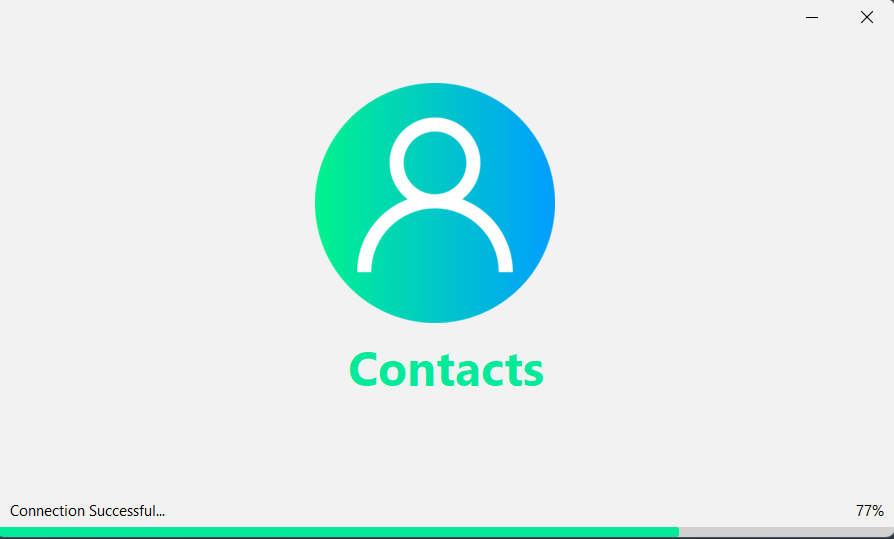
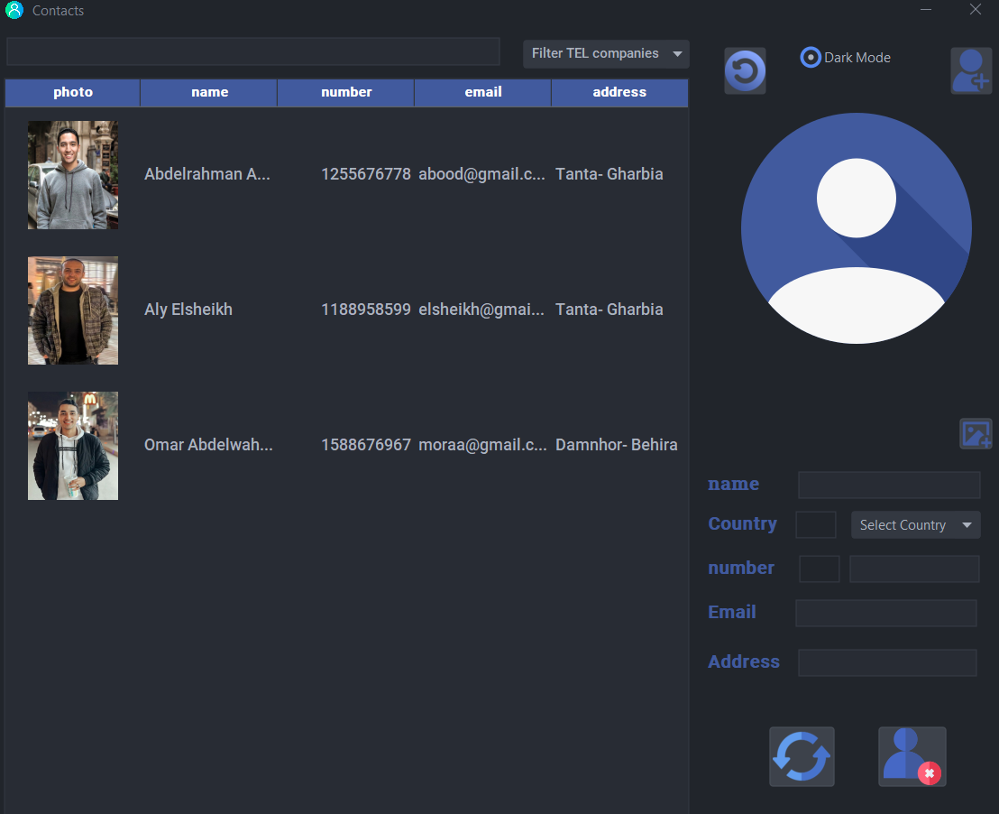
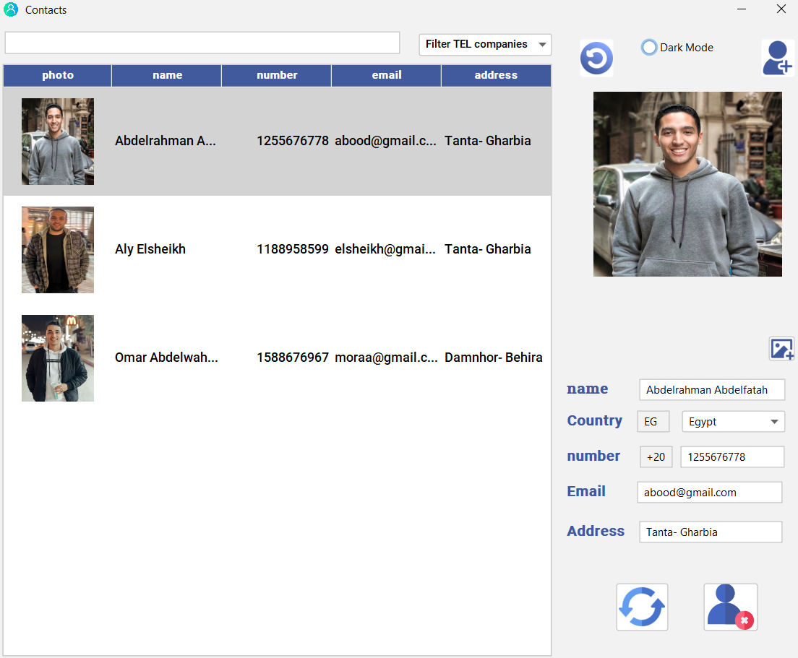

<!-- PROJECT SHIELDS -->
<!--
*** I'm using markdown "reference style" links for readability.
*** Reference links are enclosed in brackets [ ] instead of parentheses ( ).
*** See the bottom of this document for the declaration of the reference variables
*** for contributors-url, forks-url, etc. This is an optional, concise syntax you may use.
*** https://www.markdownguide.org/basic-syntax/#reference-style-links
-->
[![Contributors][contributors-shield]][contributors-url]
[![Forks][forks-shield]][forks-url]
[![Stargazers][stars-shield]][stars-url]
[![Issues][issues-shield]][issues-url]
[![LinkedIn][linkedin-shield]][linkedin-url]

<!-- PROJECT LOGO -->
 

  
  
  <h3 align="center">Contacts</h3>
  

    contact management service with CRUD Operations
     
    <a href="https://github.com/alyQamar/Contacts"><strong>Explore the docs »</strong></a>
     
     
    <a href="https://github.com/alyQamar/Contacts">View Demo</a>
    ·
    <a href="https://github.com/alyQamar/Contacts/issues">Report Bug</a>
    ·
    <a href="https://github.com/alyQamar/Contacts/issues">Request Feature</a>
  

<!-- TABLE OF CONTENTS -->

  
Table of Contents

  <ol>
<!--     <li><a href="#about-the-project">About The Project</a> </li> -->
    <li><a href="#built-with">Built With</a></li>
    <li><a href="#usage">Usage</a></li>
<!--  <li><a href="#features">Features</a></li>
    <li><a href="#exceptions">Exceptions</a></li> -->
    <li><a href="#contact">Contact</a></li>
  </ol>

<!-- ABOUT THE PROJECT -->
<!-- ## About The Project

[![Product Name Screen Shot][product-screenshot]](https://example.com)

A tool known as customer relationship management (CRM) is used to handle all interactions and relationships between your business and its clients. The objective is straightforward: strengthen business ties to expand your company. CRM systems assist businesses in maintaining contact with clients, streamlining procedures, and boosting profitability.

business domain is a Courses Company called "Coursco"

Use the `CRM_README.md` to get started.

(<a href="#readme-top">back to top</a>)

 -->
<!-- Built With -->
## Built With
* Java
* Swing
* SQL Server
* FlatLaf - intellij Look and Feel

(<a href="#readme-top">back to top</a>)

<!-- USAGE EXAMPLES -->
## Usage
* The splash screen will appear after run program

  

  
* Then program screen will appear and you can convert it to dark mode with click to dark mode Radio Button

  
* Click on any table item (Contact), contact information will appear a contact information on the righside as shown

(<a href="#readme-top">back to top</a>)

<!-- Features -->
<!-- ##  Features
* Add customer data

* update customer data

* delete customer data

* clear all Customers data

* Search for Customer by using Code or name

  

* print all costomer data

  

(<a href="#readme-top">back to top</a>)

 -->

<!-- Exception -->
<!-- ##  Exceptions
these some exceptions

  

  

  

  

 -->

<!-- CONTACT -->
## Contact

[@Aly Qamar](https://www.linkedin.com/in/alyqamar/) - alyelsamouly@gmail.com

[Project Link](https://github.com/alyQamar/Contacts)

(<a href="#readme-top">back to top</a>)

<!-- MARKDOWN LINKS & IMAGES -->
<!-- https://www.markdownguide.org/basic-syntax/#reference-style-links -->
[contributors-shield]: https://img.shields.io/github/contributors/alyQamar/Contacts.svg?style=for-the-badge
[contributors-url]: https://github.com/alyQamar//Contacts/graphs/contributors
[forks-shield]: https://img.shields.io/github/forks/alyQamar/Contacts.svg?style=for-the-badge
[forks-url]: https://github.com/alyQamar//Contacts/network/members
[stars-shield]: https://img.shields.io/github/stars/alyQamar/Contacts.svg?style=for-the-badge
[stars-url]: https://github.com/alyQamar//Contacts/stargazers
[issues-shield]: https://img.shields.io/github/issues/alyQamar/Contacts.svg?style=for-the-badge
[issues-url]: https://github.com/alyQamar/Contacts/issues
[linkedin-shield]: https://img.shields.io/badge/-LinkedIn-black.svg?style=for-the-badge&logo=linkedin&colorB=555
[linkedin-url]: https://www.linkedin.com/in/alyqamar/
[product-screenshot]: screenshots/default_mode.png
